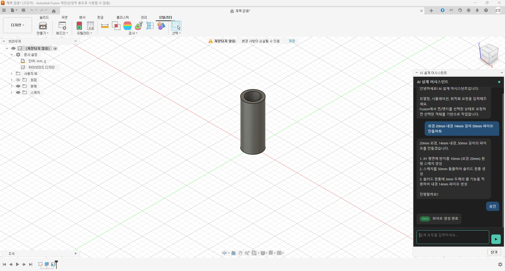
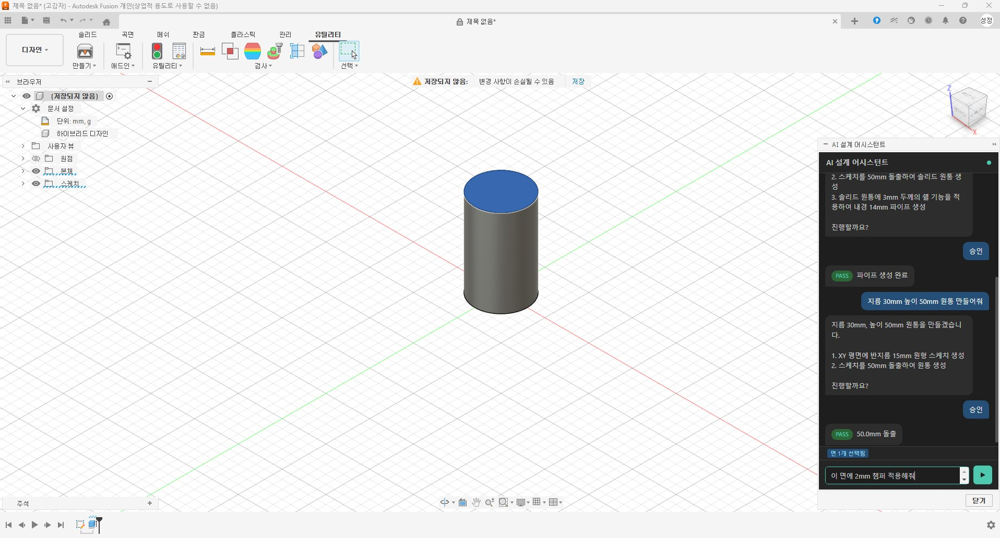
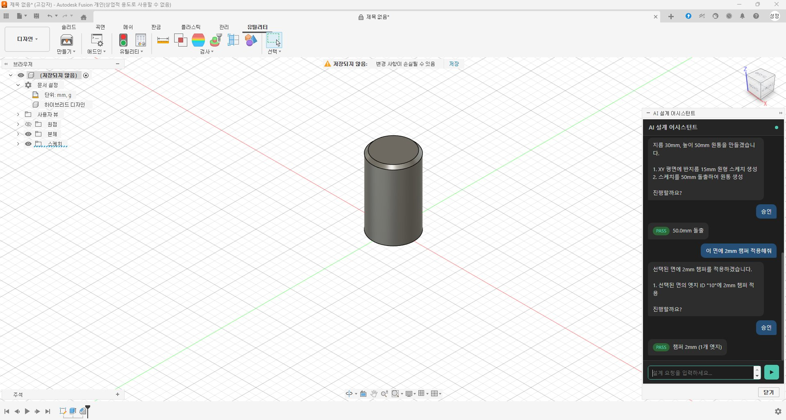

# 🤖 AI CAD/EDA 통합 설계 시스템

[](https://www.python.org/)
[](LICENSE)
[](https://www.autodesk.com/products/fusion-360)
[](https://www.anthropic.com/)

**자연어 명령 하나로 3D 모델링부터 시뮬레이션까지 자동화하는 AI 설계 파이프라인**

Fusion 360, KiCad, CalculiX, OpenFOAM 등 전문 설계 도구를 Claude API로 연결하여,
"외경 20mm 파이프 만들어줘" 한 마디로 설계부터 검증까지 자동 처리합니다.

---

## ✨ 주요 기능

- 💬 **자연어 → 3D 모델링** — Fusion 360 내장 채팅 패널에서 한국어로 설계 명령
- 🎯 **객체 선택 연동** — 면/엣지를 선택한 상태로 "이 면에 챔퍼 적용해줘" 가능
- ✅ **실행 전 확인** — AI가 설계 계획을 먼저 보여주고 승인 후 실행
- 🔄 **반복 최적화** — 시뮬레이션 결과 분석 → 수정 → 재검증 자동 루프
- 🤖 **멀티 AI 지원** — Claude, GPT-4o, Gemini 등 원하는 모델 선택 가능
- 📦 **표준부품 자동 선정** — McMaster 라이브러리 연동으로 볼트/베어링 자동 삽입

---

## 📸 스크린샷

### 자연어로 파이프 생성
> "외경 20mm 내경 14mm 길이 50mm 파이프 만들어줘"



AI가 설계 계획을 제시하고 승인 후 자동으로 3D 모델을 생성합니다.

---

### 면 선택 후 챔퍼 적용
> 면을 선택한 상태에서 "이 면에 2mm 챔퍼 적용해줘"



선택된 객체 정보를 AI에게 전달하여 맥락에 맞는 명령을 실행합니다.

---

### 자동 실행 결과


PASS 상태로 작업 완료. 모든 단계는 취소/재실행이 가능합니다.

---

## 🛠️ 지원 도구

| 도구 | 역할 | 비용 |
|------|------|------|
| **Fusion 360** | 3D 모델링, CAM | 조건부 무료 |
| **KiCad** | PCB 설계, DRC 검증 | 무료 |
| **CalculiX + Gmsh** | 구조/응력 해석 | 무료 |
| **OpenFOAM** | 유체/공력 해석 | 무료 |
| **Elmer FEM** | 열 해석 | 무료 |
| **OpenEMS** | 전자기 시뮬레이션 | 무료 |
| **Claude API** | AI 오케스트레이터 | 종량제 |

---

## 🤖 지원 AI 모델

모델 이름과 API 키만 입력하면 즉시 전환 가능합니다.

| 모델 | 명령어 | 비용 | 특징 |
|------|--------|------|------|
| Claude Sonnet | `claude` | 유료 | **추천** — Tool Use 최고 안정성 |
| Claude Opus | `claude-opus` | 유료 | 최고 성능 |
| Claude Haiku | `claude-haiku` | 유료 | 경량/빠름 |
| GPT-4o | `gpt-4o` | 유료 | OpenAI |
| Gemini 2.5 Flash | `gemini` | **무료 티어** | 기본 모델링용 |
| Gemini 2.5 Pro | `gemini-pro` | 유료 | 고성능 |

---

## 🚀 빠른 시작

### 1. 설치

```bash
git clone https://github.com/satsumaemo/ai-cad-eda-system.git
cd ai-cad-eda-system
pip install -r requirements.txt
```

### 2. 실행

```bash
# Gemini 무료 모델로 시작 (Google AI Studio에서 무료 발급)
python -m orchestrator.core --model gemini --key YOUR_GOOGLE_API_KEY

# Claude로 전체 기능 사용
python -m orchestrator.core --model claude --key YOUR_ANTHROPIC_API_KEY

# 지원 모델 목록 확인
python -m orchestrator.core --list-models

# 인터랙티브 설정
python -m orchestrator.core --setup
```

### 3. config.json으로 설정

```json
{
  "ai": {
    "model_name": "gemini",
    "api_key": "YOUR_API_KEY"
  }
}
```

```bash
python -m orchestrator.core
```

### API 키 발급

| 서비스 | 발급 링크 | 무료 여부 |
|--------|-----------|-----------|
| Google Gemini | [aistudio.google.com](https://aistudio.google.com/apikey) | ✅ 무료 |
| Anthropic Claude | [console.anthropic.com](https://console.anthropic.com/) | 유료 |
| OpenAI | [platform.openai.com](https://platform.openai.com/api-keys) | 유료 |

---

## 🗂️ 프로젝트 구조

```
ai-cad-eda-system/
├── orchestrator/        # AI 오케스트레이터 (메인 엔진)
│   └── core.py
├── adapters/            # 도구별 어댑터
│   ├── fusion_adapter.py    # Fusion 360 연동
│   ├── kicad_adapter.py     # KiCad 연동
│   └── sim_adapter.py       # 시뮬레이션 도구 연동
├── ai_adapter/          # AI 모델 어댑터
│   ├── base.py              # 공통 인터페이스
│   ├── claude_adapter.py
│   ├── openai_adapter.py
│   ├── gemini_adapter.py
│   └── factory.py           # 모델명으로 자동 생성
├── pipeline/            # 설계 파이프라인
├── validation/          # 검증 게이트
├── config.py            # 설정 관리
├── config.json          # 설정 파일 (API 키 — .gitignore 처리됨)
└── config.example.json  # 설정 예시
```

---

## 🗺️ 로드맵

- [x] 멀티 AI 어댑터 구조 (Claude / GPT / Gemini)
- [x] Fusion 360 자연어 → 3D 모델링
- [x] 객체 선택 연동 (면/엣지 선택 후 명령)
- [ ] Fusion 360 내장 채팅 패널 UI
- [ ] KiCad PCB 설계 자동화
- [ ] CalculiX 구조해석 파이프라인
- [ ] OpenFOAM 유체해석 연동
- [ ] 반복 최적화 루프 (자율 설계)
- [ ] Inventor 연동

---

## 🤝 기여

이슈와 PR을 환영합니다. 새로운 AI 어댑터나 도구 어댑터 추가는 특히 환영해요.

```bash
# 새 AI 어댑터 추가 예시
# 1. ai_adapter/deepseek_adapter.py 생성 (base.py 상속)
# 2. ai_adapter/factory.py의 SUPPORTED_MODELS에 한 줄 추가
"deepseek": (DeepSeekAdapter, "deepseek-chat", "DeepSeek V3"),
```

---

## 📄 라이선스

MIT License — 자유롭게 사용, 수정, 배포 가능합니다.

---

<p align="center">
  <sub>Built with ❤️ using Claude API + Fusion 360 + Python</sub>
</p>
